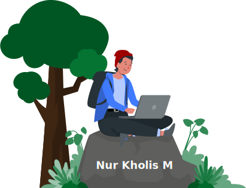

<!--  -->

<h1 align="center"><b>Hi  I'm Nur Kholis M </b></h1>

---

<table>
<tr>
<td></td>
<td>
<!--About Me-->

# About Me

<!-- - 👯 I’m looking to collaborate on  -->
<!-- - 🤝 I’m looking for help with  -->
- 🌱 I’m currently learning ***DSA;***  

- 💬 Ask me about ***Web Development;***
- 🔭 I’m currently working on ***[IGNOU की BCA कक्षा](https://bcakaksha.vercel.app)***;
- 📫 How to reach me ***<a href="mailto:dilkhush_raj@outlook.com">dilkhush_raj@outlook.com</a>***;
- 👨‍💻 All of my projects are available at ***[https://dilkhush.vercel.app](https://dilkhush.vercel.app)***;
<!-- - 📝 I regularly write articles on -->
<!-- - 📄 Know about my experiences  -->
</td>
</tr>
</table>
